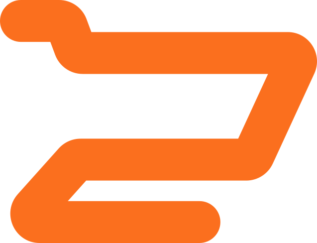

<p align="center">
  
</p>

<h1 align="center">Kart</h1>
<p align="center">Scan your groceries as you shop, live, with your camera.</p>

<p align="center">
  
  
</p>

Point your phone's camera over your cart and Kart tracks what's in it in real time, and
scans any barcode that comes into view. Each item gets outlined the moment the camera finds it,
tints green once it's confidently counted, and drops into your bag with a photo cropped from
your own camera frame. Finish the cart and it joins your trip history, persisted across launches.

## How it works

Detection and tracking run on-device, live, through a native Swift frame processor. Naming and
counting go through Kart's own recognition service:

1. **Detect**: `VNGenerateForegroundInstanceMaskRequest` finds each distinct item's mask in
   every throttled camera frame.
2. **Track**: a JS-side tracker with Kalman prediction follows each mask across frames through a
   tentative → confirmed → lost state machine, so two of the same product each keep their own
   identity as the camera moves.
3. **Scan barcodes**: `VNDetectBarcodesRequest` runs on the same frame. A decoded UPC is looked
   up against Open Food Facts and, once resolved, is treated as ground truth for that item; see
   the ODbL attribution shown wherever that data appears.
4. **Recognize**: a sharp, still frame is sent to Kart's own recognition service (`server/`),
   which asks a vision model to name and count what it sees and folds the result back onto the
   tracked items. An item the model is unsure about gets a second, closer look: a tight crop of
   just that item, sent for identification on its own.

`docs/counting-rule.md` describes how a running count survives the camera panning away and back
without double-counting or losing an item the model temporarily loses sight of.

No Anthropic or Claude model is used anywhere in this pipeline. The recognition service's API
key lives only in its own server environment and never reaches the app or a client-visible log.

## Features

- Live camera recognition with real-time item outlines and confidence states
- Barcode scanning for an instant, ground-truth identification when a UPC is visible
- A photo of each scanned item, cropped from your own camera, not a stock photo
- Cart history that persists across app restarts
- Native iOS 26 Liquid Glass chrome

## Tech stack

- **Expo (React Native)** + Expo Router, TypeScript
- **react-native-vision-camera** for the camera pipeline and frame processors
- **Apple Vision** (Swift) for on-device instance segmentation and barcode detection
- A small server (`server/`, deployed on Vercel) proxying frames to OpenAI's vision models for
  naming and counting, and to Open Food Facts for barcode lookups
- **Zustand** with AsyncStorage for state and persistence
- **Reanimated** for the interface

## Getting started

Clone it, plug an iPhone in with a cable, unlock the phone, and run:

```bash
./scripts/setup.sh
```

That is the whole thing. It asks for an OpenAI key first, so the slow part runs unattended,
then installs whatever the Mac is missing (Homebrew, Node, CocoaPods, the command line tools
pointed at Xcode, Xcode's first launch), works out your Apple team and gives this clone its own
bundle identifier, installs the app and service dependencies and the pods, points the app at
this Mac's address on your network, waits for the phone to be plugged in and trusted, and builds
and installs on it. The only other things it asks for are your Mac password, where Apple and
Homebrew require it. Re-running it is safe, and is how you pick up a changed network, a
different phone, or a re-signed build after a free Apple ID's seven days run out.

It needs Xcode, not just the Command Line Tools, because the app carries its own Swift modules.
Expo Go cannot load them, so there is no way around a real build.

Four things it cannot do for you, because Apple does not allow it. The script checks for each
one and stops with the exact thing to click rather than a build error:

| | what you do | when |
|---|---|---|
| 1 | Install Xcode from the App Store | if it is not installed; the script does the rest |
| 2 | Xcode, Settings, Accounts, add your Apple ID | first clone on a Mac |
| 3 | On the phone: Settings, Privacy & Security, Developer Mode, on, then reboot | first iPhone |
| 4 | On the phone: Settings, General, VPN & Device Management, trust the certificate | first install |

`scripts/__tests__/setup.test.ts` runs the script against a throwaway Mac with fake Apple and
Homebrew tools, in each of those states, so "works on any Mac" is a test and not a hope.

A free Apple ID is enough. It signs a build that runs for seven days, then re-run the script.

The script also starts the recognition service on this Mac and leaves it running, since the
phone dials this Mac for every scan. Keep the phone on the same wifi. After a reboot, or after
pulling a change under `server/`, one command brings it back or moves it onto the new code:

```bash
./scripts/serve.sh
```

`./scripts/serve.sh --status` says whether it is up and whether it is behind the checkout. It
also prints the address to open in the phone's Safari, which must show `{"ok":true}`: that one
check separates "the phone cannot reach the Mac" from everything else.

When a photograph fails on the phone, the screen says why in a line under the notice, with the
address it tried. Read that line first; it is the phone's side of the same check.

A line in the bag that the model was not confident of says "Not sure" in amber before anything
else, rather than being asserted like the rest, and anything the model itself says is not a
supermarket product never reaches the bag. `server/eval/CLUT.md` measures both.

Outlines are the one thing this does not set up. They come from a grounded detector too large
for a phone or a serverless function, so it runs behind `ENUMERATOR_URL` on a GPU host. With that
unset the app still names what it sees and still fills a bag, it just draws no outlines, and
`setup.sh` says so rather than leaving you to notice. Gap 2 in `docs/running-on-a-phone.md` has a
local host to run instead.

Nothing above depends on this being the machine the app was written on. The one App ID that
Apple lets exactly one team register, and the LAN address that differs on every machine, are
both worked out per clone; `project.pbxproj` is never edited locally, so a pull never conflicts
on it. See `docs/running-on-a-phone.md` for what each part was verified against.

The Simulator has no camera, so live recognition can only be verified on real hardware;
everything else runs fine in the Simulator. Best on iOS 26, where the floating chrome uses
genuine Liquid Glass.

### Without a phone

The camera path can be replayed on the Mac, with no phone and no Simulator, against real
Vision segmentation and the real recognition pipeline:

```bash
python3 scripts/make-replay-clip.py --all
npm run replay -- --clip=server/eval/corpus/replay/ov-a1c7f353-1d8.mov
```

See `server/eval/replay/README.md` for what that does and does not cover.

## Project structure

```
src/
  app/                 Screens: home, hauls, scan, cart detail
  components/          BagTray, ItemHighlights, HaulCard, GlassSurface, ...
  design/              Design tokens and type scale
  engine/              Catalog, store (carts + scan session, persisted)
  engine/liveVision/   The live recognition pipeline: tracker, fusion/counting rule,
                       barcode lookup, keyframe pacing, coverage hints
ios/Kart/              Native Swift Vision frame processor
server/                Kart's own recognition service (census + identify), deployed on Vercel
```

## License

MIT. See [LICENSE](LICENSE).
